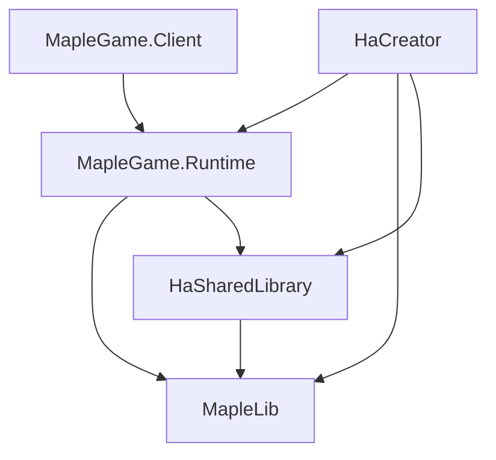

# MapSimulator extraction and game-client foundation

## Purpose

MapSimulator is implemented as a reusable game runtime with two hosts:

- `MapleGame.Client` runs maps without starting HaCreator.
- HaCreator launches the same runtime from a detached snapshot of the editor state.

This boundary is the foundation for evolving the simulator into a fuller game client.
It preserves the existing offline simulator while keeping editor concerns outside the
runtime.

## Project structure



| Project | Responsibility |
|---|---|
| `MapleGame.Runtime` | Game loop, rendering, input, physics, map materialization, runtime UI, transitions, session state and source-backed map loading. |
| `MapleGame.Client` | Windows executable, interactive launcher, command-line parsing, standalone source selection and client profile selection. |
| `HaCreator` | Board editing, snapshot capture, preview lifecycle, editor write coordination and unsaved asset overrides. |
| `MapleLib` | WZ/IMG parsing, serialization, crypto and file structures. |
| `HaSharedLibrary` | Shared rendering, audio, Spine, configuration paths and application-independent utilities. |

`MapleGame.Runtime` references only MapleLib and HaSharedLibrary. The client references
the runtime. HaCreator references the runtime through its adapter layer. Neither shared
library depends on HaCreator, HaRepacker or MapleGame.Runtime.

Runtime types retain the `HaCreator.MapSimulator` namespace where changing public and
serialized type identities would create unnecessary compatibility work. The assembly
and project references define the physical boundary; the legacy namespace does not
create an editor dependency.

## Runtime contracts

`RuntimeMapDefinition` is the owned, editor-neutral description of a map. It contains
the typed data needed by gameplay and rendering, copied extension property trees for
data that is not yet typed, and stable asset keys. Mutable WZ properties and bitmap
payloads are cloned so a runtime session never shares editor-owned or source-owned
mutable state.

`RuntimeAssetSource` and the runtime asset catalog resolve map assets with this
precedence:

1. session-owned overrides, including assets that exist only in an unsaved editor map;
2. the session data source;
3. the established missing-asset behavior.

The source-backed producer reads IMG, WZ and hybrid data directly through MapleLib.
The HaCreator producer builds the same contract from a Board. Producer parity tests
cover core map families and preserve additional property trees for forward
compatibility.

Runtime production code must not depend on Board, MultiBoard, editor instance or info
types, editor dialogs, HaCreator application globals, or HaRepacker assemblies. New
runtime features should accept narrow contracts or services rather than adding a new
global service locator.

## HaCreator preview flow

The editor preview path is:

1. Quiesce editor rendering long enough to capture a consistent snapshot.
2. Materialize lazy metadata required by the snapshot.
3. Copy the selected map and other open maps that may be transition destinations.
4. Copy unsaved/custom asset overrides into session-owned CPU data.
5. Start `GameSessionHost` on its STA game thread.
6. Resume editor rendering when capture is complete; keep preview completion and
   shutdown coordination in `EditorPreviewController`.

Snapshot creation does not save the map, mutate its minimap, or change undo history.
The runtime owns every GPU resource it creates from the copied data. Closing a preview
must restore editor input/rendering, release the one-session guard and retire the
session source, map generations, graphics resources, audio and native window state.

`EditorRuntimeWriteCoordinator` isolates preview reads from editor save, repack and
source-switch writes. Built-in detached IMG, WZ and hybrid preview sources do not
hot-swap during a session. A later preview opens a new source generation and observes
new backing content. External replacement while a reader is open follows Windows file
locking rules; active whole-tree hot swap is outside the current contract.

## Standalone client

The standalone host supports:

- an exported IMG directory;
- a legacy WZ installation;
- an IMG directory with WZ fallback;
- standard MapleStory encryption versions or an explicit four-byte IV;
- an optional map ID, initial portal and profile directory.

The launcher appears when a data source is not supplied on the command line. A
standalone session creates its own source manager and profile; it does not initialize
HaCreator, construct a hidden Board, or replace an editor-global WZ manager. Map and
world-map transitions use `RuntimeMapProvider`.

See [the client README](../../MapleGame.Client/README.md) for launch and packaging
commands.

## Map activation and lifecycle

Map changes use a candidate generation:

1. Load and preflight the requested destination without replacing the active map.
2. Reject and dispose an invalid or cancelled candidate, leaving the old generation
   active.
3. Commit a valid candidate on the game thread and retire the previous generation.
4. Treat mandatory activation failure after commit as fatal to the session. Shared
   session mutation makes rollback after that point unsafe.

`GameSessionHost` owns the STA thread and exposes completion and cancellation through a
session handle. It prevents duplicate sessions and disposes the game on its owning
thread before releasing the guard. Sources, caches, map generations and native/GPU
objects are session-owned; process-wide framework objects remain framework-owned.

Offline return/revive behavior remains the established local respawn and packet-driven
behavior. The extraction does not add automatic offline loading of a configured
forced-return map.

## Build, test and package

Use the repository setup and build requirements from `AGENTS.md`. Run the affected
projects directly while iterating:

```powershell
dotnet build MapleGame.Client/MapleGame.Client.csproj -c Debug
dotnet build HaCreator/HaCreator.csproj -c Debug
dotnet test UnitTest_MapleGame/UnitTest_MapleGame.csproj
dotnet test UnitTest_MapSimulator/UnitTest_MapSimulator.csproj
dotnet test UnitTest_WorldMapEditor/UnitTest_WorldMapEditor.csproj
dotnet test MapleLib/MapleLib.Tests/MapleLib.Tests.csproj
```

Run the solution in Debug and Release before integration. The standard solution uses
the repository's nested WzImg MCP submodule path, so initialize submodules recursively
before building. Local checkouts that intentionally keep WzImg MCP as a sibling may
generate a machine-local solution for validation; do not commit absolute paths.

Create the framework-dependent Windows x64 client package with:

```powershell
python release.py --client
```

The package must contain the executable, runtime/shared dependencies, native libraries,
JSON manifests and the shared `Content` fonts. It must not contain HaCreator,
HaRepacker or legacy CLR host assemblies. Test the extracted archive from a different
working directory with profiles and game data stored outside the archive.

Graphics and real-data tests are opt-in because they require a Windows graphics device
and external MapleStory data. Use the environment variables documented by the test
classes, and keep game assets outside source control.

## Compatibility work that remains manual

Automated coverage exercises the assembly boundary, both map producers, source
ownership, map activation, cancellation, portal collision, custom bitmap ownership,
cache eviction, external replacement boundaries and repeated graphics lifecycle.
Clean-directory client checks cover IMG, WZ and hybrid startup/render/close, and live
HaCreator checks cover existing, unsaved and empty-map preview lifecycle.

The following areas still require broader hands-on compatibility testing as the client
develops:

- movement, slopes, ladders, combat, skills, special fields, Spine effects, BGM and UI;
- live keyboard-driven portal, script, packet, return and revive transitions;
- resolution, fullscreen, DPI, focus, keyboard, IME and clipboard behavior;
- live editor custom-asset authoring, undo/dirty inspection and failed/cancelled launch;
- save, repack and source-switch interaction with an active preview;
- profile migration, audio-device recovery and bounded native-memory observation.

Record unsupported behavior explicitly. Do not treat compilation, package creation or
an empty log as graphical validation.

## Future client roadmap

The extraction supplies an offline game-client foundation. Future work can build on it
without moving editor state back into Runtime:

1. Complete offline gameplay and field-system parity using runtime-owned services.
2. Define a versioned network/session boundary around existing packet codecs and local
   simulation services.
3. Add authentication, character selection and channel/world lifecycle behind injected
   services, retaining an offline implementation for HaCreator preview.
4. Expand profile, patching, diagnostics, input and audio support for a distributable
   client.
5. Add long-running compatibility and resource tests for supported data versions and
   graphics hardware.

Online behavior is a separate development program. MapleLib remains the WZ/protocol
foundation, HaSharedLibrary remains the rendering/audio utility layer, and HaCreator
continues to consume the runtime only through detached preview contracts.
